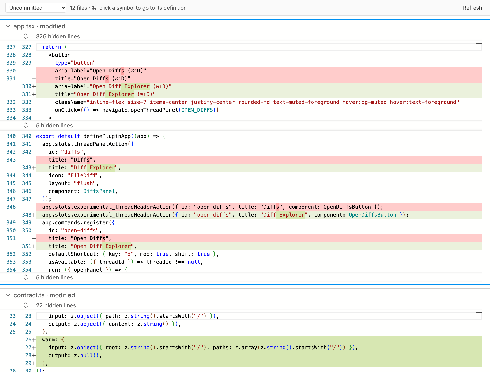
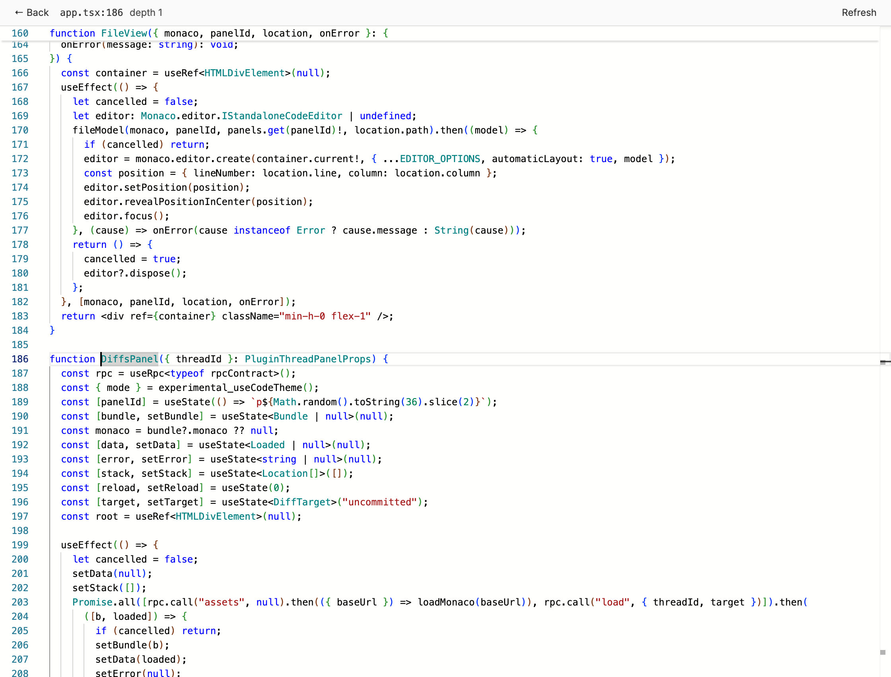

# Diff Explorer

A [BB](https://getbb.app) plugin. Review a thread's changes, and jump into the code behind them.



## What it does

- Shows every changed file in one scrolling view.
- Switches between **Uncommitted** and **All changes** since the base branch.
- ⌘-click a symbol (or press F12) to open its definition.
- Jump again to go deeper. Press **Ctrl+-** to go back one level.
- Opens from the thread header button, or with **⌘⇧D**.



## Install

```sh
bb plugin install git:https://github.com/arashout/bb-plugin-diff-explorer.git
```

## Go to definition needs a language server

| Language | Server (on your PATH) |
|---|---|
| TypeScript, JavaScript | `npx` (downloads `typescript-language-server` on first use) |
| Go | `gopls` |
| Rust | `rust-analyzer` |
| Python | `pyright-langserver` |
| C, C++ | `clangd` |
| Swift | `sourcekit-lsp` |

Other languages still show the diff.

## Develop

```sh
npm install
npm run build:monaco   # only after changing scripts/multi-diff.js or the Monaco version
bb plugin install .
```

## License

MIT. Bundles Monaco and code adapted from VS Code (both MIT, © Microsoft).
