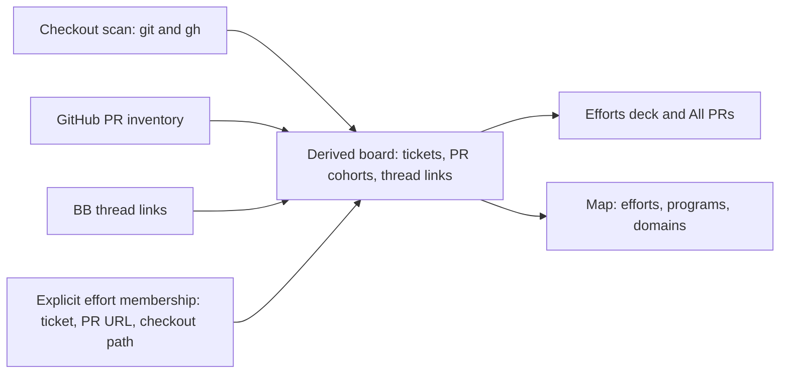
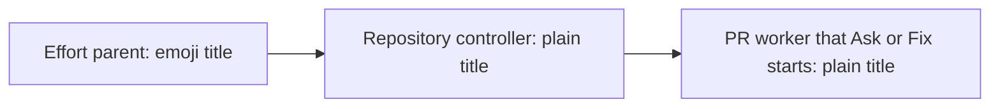

# Workstreams

Workstreams connects git checkouts that belong to the same ticket, even across
repositories. Its Efforts deck shows one card per effort, with the effort's open
pull requests sorted by the move each needs. All PRs lists every open pull
request you author or an effort names. Its Map groups tickets into efforts,
programs, and domains when the evidence supports those levels.

## Get started

From this directory:

```sh
npm install
bb plugin install .
bb plugin config workstreams
```

Set `scanRoots` to the directories that hold your checkouts. If you leave it
empty, Workstreams scans the paths of your BB projects. Open **Workstreams** in
the sidebar, or run `bb workstreams refresh` followed by `bb workstreams list`.

An authenticated `gh` supplies pull request state and enables GitHub actions.
Without it, the board shows observed local git activity, marks other checkouts
as unverified, and shows a warning. Workstreams looks
for ticket keys in branch names, Linear linkback comments, pull request titles
and descriptions, and checkout directory names, in that order. A ticket's
checkouts form one cluster. Related clusters can form an effort; levels that do
not add information collapse.

## Choose enrichment

The board works without model keys. Optional keys add detail:

| Setting | What it adds |
| --- | --- |
| `linearApiKeys` | Ticket titles, state, project, parent, and team names from each matching Linear workspace. The older `linearApiKey` setting still works. |
| `typesafeApiKey` | Jev selects ticket summaries and assigns related tickets to efforts and higher groups. |
| `anthropicApiKey` | With Jev enabled, Claude Sonnet 5 names groups and flags groups whose members look unrelated. It does not change membership. |

Set these under **Plugins → Workstreams** or with `bb plugin config workstreams
set <key> <value>`. Keys are optional. An Anthropic key alone does not enable
grouping.

The scanner stores board facts and caches in BB's local plugin storage. It uses
`git` locally and your authenticated `gh` to read GitHub pull requests and
perform GitHub actions that you confirm. A Linear key sends ticket identifiers
to Linear and retrieves issue details. With model keys, Jev receives ticket
keys, repository names, pull request titles, and available Linear context to
select summaries and groups. Bounded Jev reviews can revisit uncertain
singletons and mixed groups using shared outcome evidence; saved effort
membership stays fixed. Anthropic receives the member keys, summaries,
repository names, candidate phrases, and available Linear or thread-title
context needed to name a group. Automatic grouping calls happen when semantic
inputs change; an unchanged rescan reuses cached decisions.

Workstreams starts planning and context threads with the **Planning model** setting (`planningModel`, default `codex/gpt-6-sol/medium`) and work, repair, and effort repository controller threads with the **Code-work model** setting (`codeModel`, default `codex/gpt-6-sol/high`). Each value is `providerId/model/reasoningLevel`. Existing threads from another provider remain available as history, but Workstreams doesn't send them Ask or Fix turns: message such a thread in BB directly, or set the Code-work model to its provider.

## Organize work from a thread

The effort chip above the thread composer shows the thread's effort: its
color dot, its name, and its Your turn count. Select the chip to open
that effort's card on the deck. A thread without an effort of its own shows the
card the deck puts it on: the effort its linked PRs are in, else the service
card of the repository most of its PRs are in, such as `folio · service`, with
its count. Every open PR no effort owns is on its repository's service card. A
thread with no effort and no one repository shows **No effort**; the deck lists
it under **Loose threads**. The chip counts the PRs the thread records and the
PR in a checkout only it runs in. A PR that the thread reaches only by branch
name, a path it worked in, or a checkout other threads share doesn't count.

Select **⌄** beside the chip to change the effort. Type to filter the list, or
use the up and down arrow keys, then press Enter to pick. Esc closes the
popover. Suggested efforts come first, each with the strongest signal behind
it: the effort has a PR that the thread links, the thread title names one of
its tickets, the classifier suggests it for a linked PR, or it's the parent
thread's effort. With a TypeSafe key, **Ask Jev to suggest** asks Jev to
compare the thread with your efforts; it runs only when you select it. **+ New
effort** creates an effort from the name you typed. **Remove from effort** is
at the bottom. A pick applies at once, and **Undo** appears beside the chip for
8 seconds. Undo puts back the thread's effort and lets go the work that the
change brought in. It refuses, changing nothing, once that work moved again,
or when it would put work back into a done effort.

After you assign a thread, its confirmed, unassigned work inherits the effort,
including existing recorded work and work discovered later. Workstreams
discovers PRs through the thread's exact checkout, recorded actions, or
explicit PR links. A PR mentioned only in a title or discussion doesn't inherit
automatically. Existing explicit assignments stay intact, and removing the
thread from its effort leaves assigned work where it is.

The popover lists the thread's linked PRs as chips. A PR in another effort
names that effort and offers **Move here**, which moves it into the thread's
effort with its ticket; a ticket move includes its related PRs and checkouts.
When a move takes more than that PR and its tickets, **Move here…** first lists
what else moves and waits for **Move all**.
**+ Link PR** lists tracked pull requests to link to the thread. Both take an
Undo. A done effort takes no new work: reopen it first.

Explicit assignments use the same ticket and PR membership as the board.
Assigning work preserves existing thread parents and worker history and does
not create a coordinator or start an agent.

## How work and agents connect

Workstreams combines scanned checkouts, GitHub pull request inventory, and
thread links into work context. Explicit effort membership for a ticket, pull
request, or checkout path takes precedence over inferred grouping. The views
read the resulting board without starting threads.



When a checkout gains a PR, its explicit path membership supplies the effort
unless an explicit ticket or PR owner takes precedence.



Ask and Fix start a PR worker only for a PR with no thread, and only beneath a
parent that already exists: its effort's repository controller, or its
repository's child of the shared **Unassigned work** parent when no effort owns
it. Without one, the PR is skipped with why. A controller can work directly or
delegate a bounded task to a child. Unassigned placement organizes threads
without assigning the PR or checkout to an effort.
Legacy bulk Advance no longer runs. Its saved jobs stay readable as history,
and the isolated worktrees it created stay on disk for inspection; automatic
cleanup is not implemented.

## Use the views

Every view shares one header. Its tabs are **Efforts** and **All PRs**, and
**More** opens **Map**, **Efforts admin**, and **How it works**. On its right,
the header shows when the view last read its data, **Mark seen** on a view that
has it, **⌘K**, and **?**. In Efforts and All PRs, ⌘K lists every action and ?
lists the keys. On other views, ⌘K goes to a view, and ? opens How this works.

- **Efforts:** Workstreams first opens here, then on the last view you chose.
  **Overview** comes first, before the effort cards, and takes no number key.
  Its action matrix shows what needs you and what's blocked in each effort,
  **Aging blockers** lists the oldest waits on others, and each effort's tile
  names its next step. Select any of them to open that effort's card. Flip
  cards with [ and ], or press 1–9 for an effort. A card lists its open PRs by
  the move each needs. Every GitHub write lists each PR in a confirm, then
  waits with Undo, and a merge runs only from the fresh merge preview.
- **All PRs:** Every open PR you author and every open PR an effort names, in
  two lists. **Your turn** comes first, by effort, with **No effort** last:
  your PRs where a person's approval comment has no reply of yours after it,
  their change request has no push or reply since, an open thread's last word
  is theirs, or their comment has no reply of yours. Bots, such as Claude,
  Codex, or Copilot, never put a PR there. Each row says why in one line.
  **Dismiss** hides a row until its head moves or someone says something new;
  "N dismissed · show" brings them back. Select rows (x, a click, Shift for a
  range, or ⇧X for all) and **Address N** (b) starts one batch thread for them
  at once, with no listing: it waits 8 s for Undo, then starts on the code-work
  model, under the effort's parent when every PR shares one. Its prompt opens
  with a link to each PR, as its first reply and its report do. It holds each
  PR until it finishes, addresses every comment, bots' included, replies to
  each reviewer's note, never merges, and ends with a plain report per PR.
  It works in each PR's checkout; a PR with none gets one worktree, added
  from a local checkout of its repository and named after its head branch,
  next to the other checkouts, so later scans reuse it. It never clones, so a
  PR whose repository has no local checkout stays out.
  Each sent PR links its thread with BB's status for it: Working, Needs you,
  Failed with why, or Idle. The link stays while the PR is open, on Other
  open PRs once it leaves Your turn. A PR it didn't send says why in one
  line. The deck's selection offers the same.
  **Other open PRs** follows, by effort; each row shows the PR's state
  and next step. A change request you answered with a push or a reply waits
  here with **Re-request @login**, and approval notes you answered wait here
  on your Confirm; both still hold the merge, and Address leaves them out.
  **Nudge** appears only where a reviewer has waited long
  enough, and the server checks again before it sends. Your turn rows offer
  none. All PRs exposes review confirmations, holds, and merge previews;
  each effort's name opens its read card.
  Select **Other open PRs** individually or with its heading checkbox, then
  **Advance selected** to review the exact scope and start one fresh thread.
  Mixed selections across both lists work too. Holds, stopped efforts, and
  changed heads are skipped; older workers stay untouched. **Plan Advance All**
  instead creates a prioritized plan for every open, unheld PR, independent of
  selection.
- **Efforts admin:** Administer explicitly saved efforts from one list.
  Create an effort without starting a thread, edit its name and goal, archive
  it, or restore it. Archived efforts retain their work and history. **Merge into…**
  previews combined membership and thread routing before applying the change.
  The destination keeps its identity, and old effort IDs resolve to it.
  Thread conversations remain separate. Resolve any preview blockers before
  merging; pending thread updates remain visible for retry. Archiving waits
  for queued or active preparation to settle. Renaming also updates an idle
  coordinator's title; if that update fails, save again to retry.
- **Map:** Explore the grouping hierarchy. Switch between theme and risk faces,
  filter by status and code surface, and open a linked agent thread.
- **Approved filter:** Keep approved open PRs in view on the Map; the selection
  persists across reloads. The Map dims nonmatching work without changing its
  layout and counts checkout-backed PRs.
- **Archived threads:** Archive an idle leaf thread from its thread menu on the
  Map. Use **Archived threads** to review history or undo an archive. Workstreams
  will not archive a thread with children.
- **How this works:** Open the ⓘ panel for how each view works, shortcuts, scan
  health, and warnings.

`bb workstreams list [--json]` reads the last scan. Workstreams also refreshes
on relevant git ref changes and idle thread transitions, plus its configured
interval; use `bb workstreams refresh` when freshness matters. It does not
subscribe to GitHub webhooks. `bb workstreams group <TICKET> <effort name>` sets a
manual effort name; `bb workstreams ungroup <TICKET>` removes it.

The **In release tag** label means a merged commit appears in a local release
tag. It does not verify deployment. When a repository has no usable release
tags, merged work remains `merged` and the board warns.
Closed pull requests that did not merge are omitted from the Map,
even when their checkouts are dirty or ahead of upstream. Merged work remains
visible.

To pause one PR, choose **Hold PR** in its details on an effort's card, with an
optional reason. A held PR keeps its GitHub readiness and thread access, sits
in its card's **Held** section, and no batch or Advance touches it until you
release it. **Release** returns it to its current readiness group without
changing GitHub.

## Develop

The scanner and Anthropic naming call live in `host.ts`. `server.ts` handles
settings, local storage, refresh, enrichment, actions, and the CLI. The grouping
and lifecycle rules live in `workstreams.ts`; `app.tsx` mounts the effort deck, the PR
inventory (All PRs), the Map, and Efforts admin. `pr-stage.ts` derives PR stages and blockers from
scanned facts.
`contract.ts` defines the host RPC schema, and `skills/workstreams/SKILL.md`
documents the CLI for agents.

```sh
npm test
npm run typecheck
npm run build
```

After editing the plugin, run `bb plugin reload workstreams`. The build creates
the distributable files in `dist/` for git or npm installs.


Effort cards include an expandable **Threads** section with status counts and last activity. It lists all linked threads, including PR workers, with exact PR references and per-thread activity times. **Archive** accepts idle threads after checking their current status and descendants; **Undo** or **Archived threads…** restores them without starting the agent. Threads with subthreads are managed from BB. This uses cached thread facts, without fetching extra event logs for the card.
